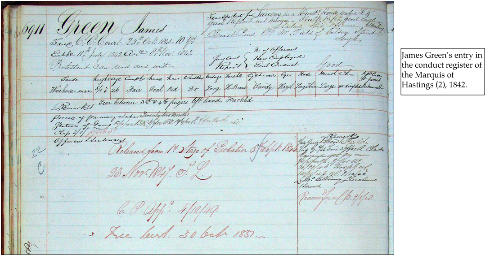
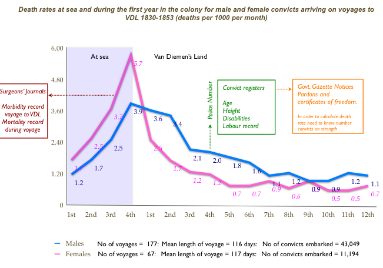
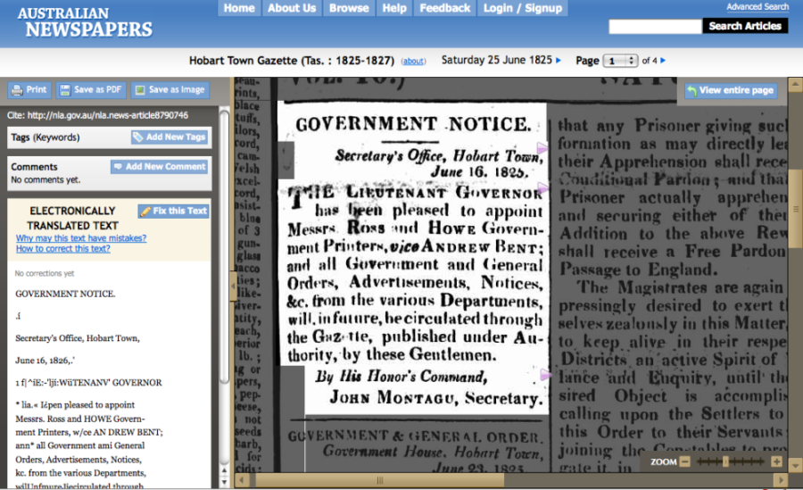

Title: Humanities computing and Drupal  
Subtitle: Or, What I did on my holidays  
Author: Claudine Chionh  
Affiliation: University of Melbourne  
Date: 2 March 2010  
Event: LUV meeting
LaTeX XSLT: beamer  
Theme: CambridgeUS

# Unlocking the ivory tower

## Founders and Survivors

#### The *Claudine*

Woolwich 24/aug/1821 to Hobart 15/dec/1821 -- 113 days at sea

160 male convicts boarded, 159 survived/landed (not a bad record)

#### Journal

#### Conduct registers

#### Archives of Tasmania convict index

#### Founders and Survivors

#### Van Diemen’s Land

Transportation period, 1803-1853

~ 13,000 female convicts

~ 25,000 male convicts

~ 1 million rows of data

Quantifiable data: conduct registers, BDM...

Text: journals, newspaper reports

#### Genealogists

What happened to convicts after they were freed?

Links with genealogists for lives of convicts and their families.

#### The 'factory plan'

#### The Founders and Survivors project

Transportation of convicts to Van Diemen's Land, 1803-1853

and their impact on modern Australia

#### Databases: From paper to digital

#### What we have done

~ 40,000 convicts

~ 1 million rows of data

Collaboration: Submitting convict ancestors

#### What we hope to do

Digitising historical sources

Collaboration: Correcting transcriptions

#### Problems/challenges

'Amateur' developer

Isolation

## Humanities computing

#### 'Humanities computing'

Or 'digital humanities'?

#### Old questions, new tools?

Digitisation

Analyse large[r] amounts of material

Public access and collaboration

#### The Valley of the Shadow

#### The Valley of the Shadow

#### Old Bailey Online

#### Perseus Digital Library

Virgil's *Aeneid*

#### Literary and linguistic applications

Index Thomisticus (1946)

Perseus

#### Historical applications

Digitisation

Data analysis

Collaboration

#### Digitisation

Documents

Images

Linked/cross-referenced presentation of sources

#### Tasmanian Police Gazette, 1861-1933

#### Surgeon's journals

#### Conduct registers

#### Data analysis

#### GIS

#### Collaboration

## Why FOSS?

#### Why FOSS?

Use of resources

Community of developers

Using and adapting tools

Access

Values

#### Use of resources

Expenses:

- Processing power
- Storage
- Bandwidth

#### Community of developers

Mutual support

Don’t reinvent the wheel

#### Using and adapting tools

e.g. TEI, GEDCOM

#### Access

Make archival sources and research results accessible to general public

e.g. online museums

Sharing data with other researchers

#### Values

Public interest

Free access, free expression

Dialogue

Public participation

## Why Drupal?

#### Free

Values: free, open

Low cost

#### Web framework

Modular

Define our own content types and views

Define user roles

Workflow

#### Why *Drupal*?

Decision up to one developer

Exposure to Drupal on many other sites

## Challenges

#### The Two Cultures

*The Two Cultures and the Scientific Revolution*

CP Snow, Rede Lecture, 1959

Literature/humanities vs science/tech

#### Many cultures?

Translating between academics, IT professionals, diverse public audience

Different priorities, research questions

#### Geeks and non-geeks

Non-geeks may not understand the values behind FOSS

Technology as magic

#### Where do developers belong?

Identity crisis

'Digital humanities professional'?

Background -- IT or academic?

Autonomy

Career progression

Where do humanities computing projects belong?

#### Resources and evaluation

Resource needs and output not like in traditional academic projects

In: computer resources, not just research time

Out: software, web, data, not just articles

#### Evolving field

Challenging

Exciting

Where to from here?

#### Links

The Valley of the Shadow <http://valley.lib.virginia.edu/>

Old Bailey Online <http://www.oldbaileyonline.org/>

Perseus Digital Library <http://www.perseus.tufts.edu/>

Index Thomisticus <http://www.corpusthomisticum.org/it/>

#### Links

Founders and Survivors <http://www.foundersandsurvivors.org/>

Mapping Our Anzacs <http://mappingouranzacs.naa.gov.au/>

Australian Newspapers (National Library) <http://newspapers.nla.gov.au/>

Essays in Humanities Computing <http://www.digitalhumanities.org/Essays/>

## Data migration

#### Questions/advice?

<http://www.foundersandsurvivors.org/>

<http://www.slideshare.net/claudinec>

`claudine@foundersandsurvivors.org`
