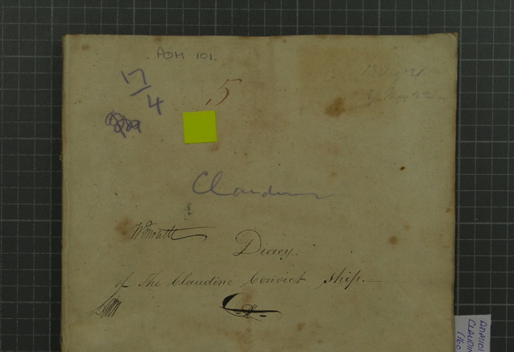
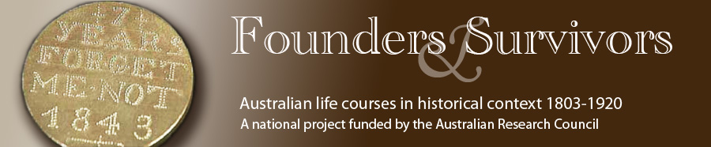
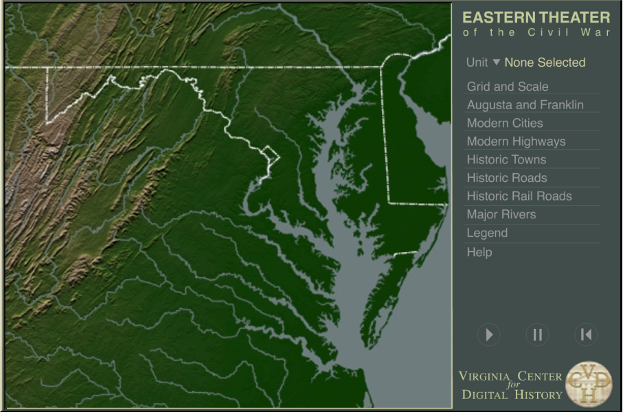
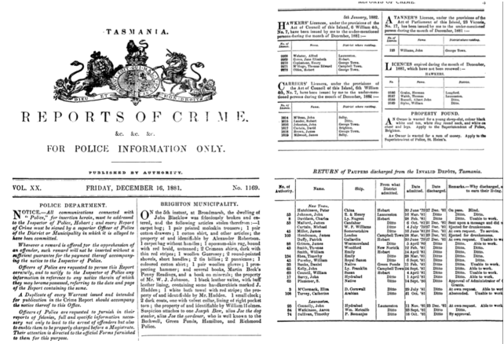
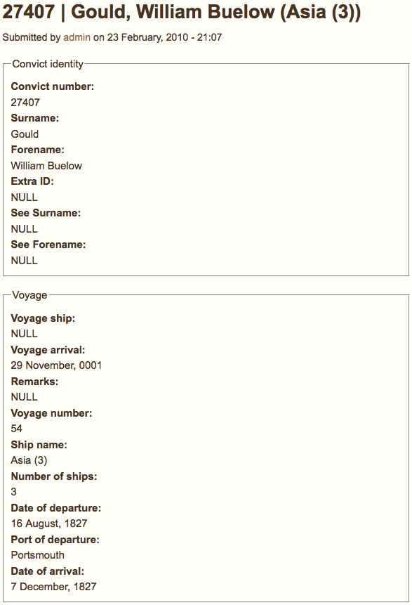
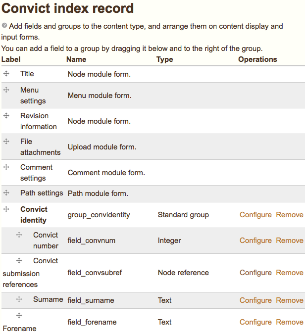
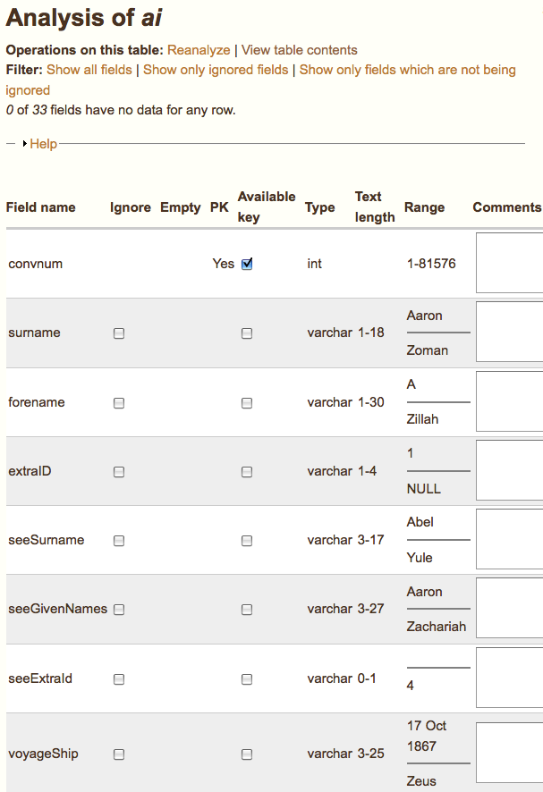
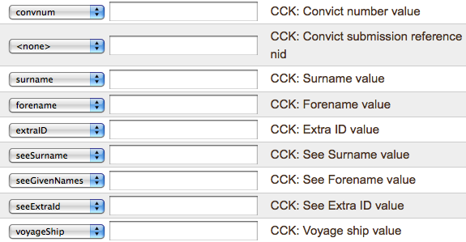
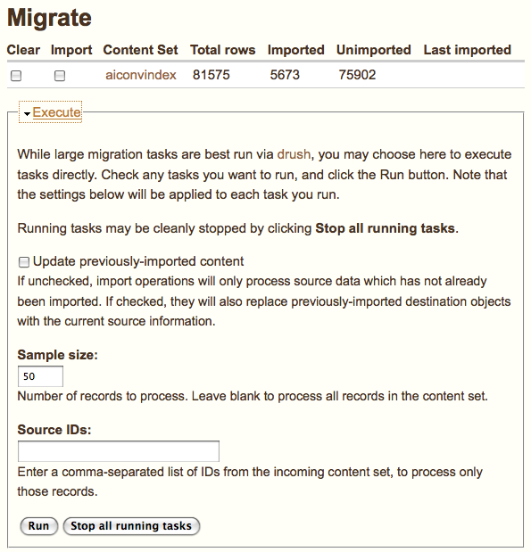

Title: Humanities computing  
Author: Claudine Chionh  
Affiliation: University of Melbourne  
Date: 2 March 2010  
Event: LUV meeting
LaTeX XSLT: beamer  
Theme: CambridgeUS

#### Overview

The Founders and Survivors project

Humanities computing

Why FOSS?

Challenges

Drupal in action: Data migration

## Founders and Survivors

#### The *Claudine*

Woolwich 24/aug/1821 to Hobart 15/dec/1821 -- 113 days at sea

160 male convicts boarded, 159 survived/landed (not a bad record)

#### Journal

#### Conduct registers

#### Archives of Tasmania convict index

#### Founders and Survivors

#### Van Diemen’s Land

Transportation period, 1803-1853

~ 1 million rows of data

Quantifiable data: conduct registers, BDM...

Text: journals, newspaper reports

#### Genealogists

What happened to convicts after they were freed?

Links with genealogists for lives of convicts and their families.

#### The 'factory plan'

## Humanities computing

#### Old questions, new tools?

Digitisation

Analyse large[r] amounts of material

Public access and collaboration

#### The Valley of the Shadow

#### The Valley of the Shadow

#### Old Bailey Online

#### Perseus Digital Library

Virgil's *Aeneid*

#### 'Libraries': Literary and linguistic applications

Index Thomisticus (1946)

Perseus

#### 'Archives': Historical applications

Digitisation

Data analysis

Collaboration

#### Digitisation

Documents

Images

Linked/cross-referenced presentation of sources

#### Tasmanian Police Gazette, 1861-1933

#### Surgeon's journals

#### Conduct registers

#### Data analysis

#### GIS

#### Collaboration

## Why FOSS?

#### Why FOSS?

Community of developers

Access

Values

#### Community of developers

Mutual support

Don’t reinvent the wheel

Using and adapting tools

#### Access

Make archival sources and research results accessible to general public

Sharing data with other researchers

#### Values

Public interest

Free access, free expression

Dialogue

Public participation

## Challenges

#### The Two Cultures

*The Two Cultures and the Scientific Revolution*

CP Snow, Rede Lecture, 1959

Literature/humanities vs science/tech

#### Many cultures?

Translating between academics, IT professionals, diverse public audience

Different priorities, research questions

#### Geeks and non-geeks

Non-geeks may not understand the values behind FOSS

Technology as magic

#### Where do developers belong?

Identity crisis

'Digital humanities professional'?

Background -- IT or academic?

Autonomy

Career progression

Where do humanities computing projects belong?

## Data migration

#### Screenshot: Index record

#### Why Drupal?

Modular

Define our own content types and views

Define user roles

Workflow

#### Index data

Access --> Excel --> CSV

--> Drupal?

Database on the web

#### Content Construction Kit

<http://drupal.org/project/cck>

Define your own data structures in Drupal

#### Rules

<http://drupal.org/project/rules>

More powerful than core Trigger and Action modules

Generate a title for each node

`{index number} | {convict name} ({ship name})`

#### Views

<http://drupal.org/project/views>

Define your own views of content

#### Table Wizard

<http://drupal.org/project/tw>

Expose a MySQL table or CSV file to Views

#### Table analysis

#### Migrate

<http://drupal.org/project/migrate>

Map structure of external table to a Drupal data structure

Migrate Extras <http://drupal.org/project/migrate_extras> to migrate to CCK fields

#### Content set

#### Migrate dashboard

#### Drush

Web-based dashboard good for testing on small samples

Drush: the Drupal Shell <http://drupal.org/project/drush>

(out of memory issues)

Run `drush migrate-import {content set}` from cron

Approx. one week to migrate ~ 80,000 records

## Where to from here?

#### Next stage of project

(manually) linking official index with public submissions

* later life stories
* WWI links

#### Links

The Valley of the Shadow <http://valley.lib.virginia.edu/>

Old Bailey Online <http://www.oldbaileyonline.org/>

Perseus Digital Library <http://www.perseus.tufts.edu/>

Index Thomisticus <http://www.corpusthomisticum.org/it/>

#### Links

Founders and Survivors <http://www.foundersandsurvivors.org/>

Mapping Our Anzacs <http://mappingouranzacs.naa.gov.au/>

Australian Newspapers (National Library) <http://newspapers.nla.gov.au/>

Essays in Humanities Computing <http://www.digitalhumanities.org/Essays/>

#### Questions/advice?

<http://claudine.github.com/2010/02/17/drupal-table-wizard-migrate.html>

<http://www.slideshare.net/claudinec>
